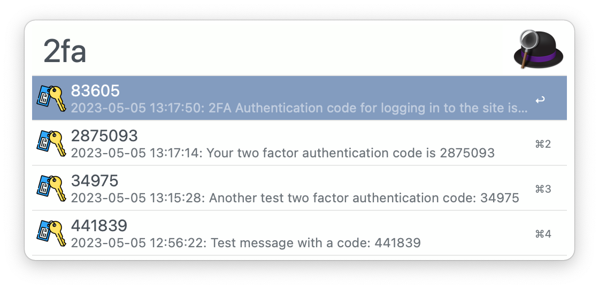

# Search Apple Messages for two-factor authentication codes and easily paste them in any app

macOS supports [autofilling security codes sent to your iPhone](https://support.apple.com/guide/safari/autofill-security-codes-from-your-iphone-ibrwa4a6c6c6/mac). This is a great feature if you are using Safari, but it is not supported in other browsers (e.g., Chrome) and apps (e.g., an Electron app). This Alfred workflow adds this feature across the system.

[Install from Alfred Gallery](https://alfred.app/workflows/thebitguru/simple-2fa-paste/)

---

## Usage

1. Launch Alfred.
2. Enter the configured keyword (`2fa` by default).
3. Select the correct two-factor code if it isn't the first one. You can also use shortcuts like Command+2 or Command+3 to select and paste in a single go.

4. If you did not use Command+2, or another number, shortcut then press enter to paste in the currently active text field.

---

## Inspiration

This workflow builds upon https://github.com/squatto/alfred-imessage-2fa. One of the major differences is that this workflow uses simple `bash` instead of `php`, thus eliminating the need for any more than what your system already has.

---

Icon made by [flaticon.com/authors/freepik](https://www.flaticon.com/authors/freepik) from www.flaticon.com.

---

## Known Issues

1. Starting with macOS Ventura, Apple changed the format of the underlying database (`chat.db`) where now it saves an encoded version of the message in `attributedBody` field instead of the simpler, unencoded `text` field. `text` is still populated when the message is first received, but gets converted to `attributedBody` at some later time. This workflow should still work for new messages, but will not find older messages yet.