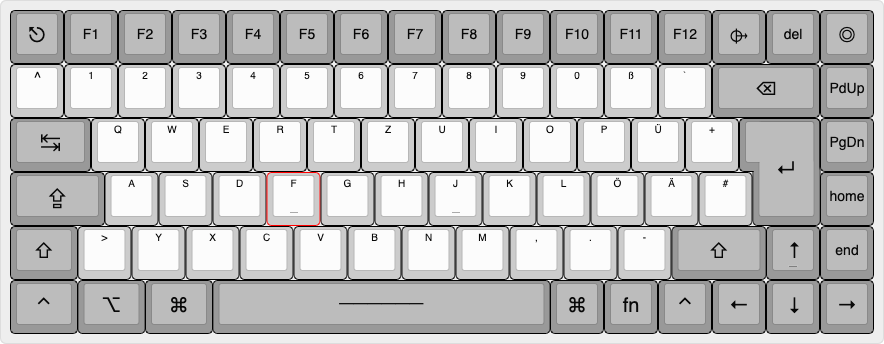
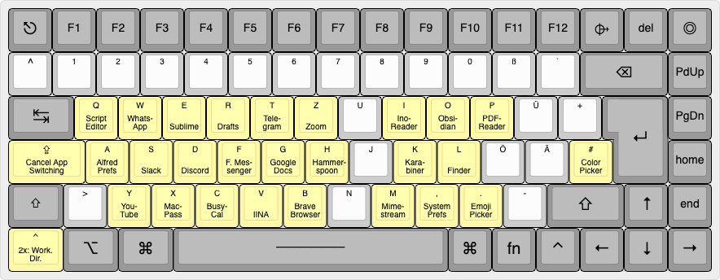
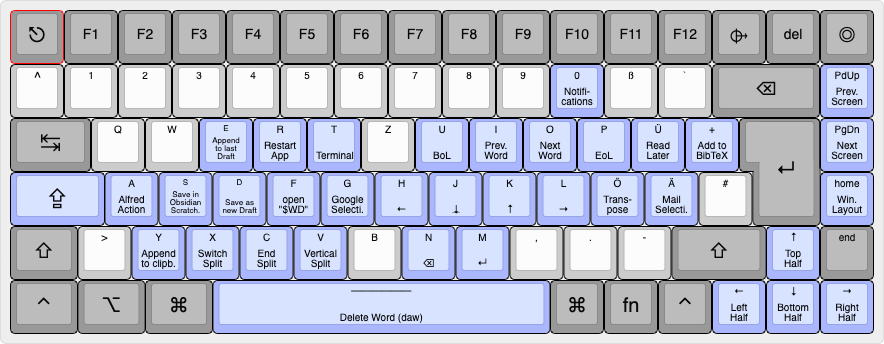
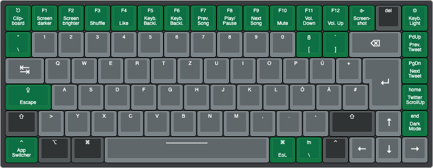

# Visualized Keyboard Layout
Created with the fantastic [Keyboard Layout Editor](http://www.keyboard-layout-editor.com/#/). Bindings implemented via [Karabiner Elements](../.config/karabiner/).

## Base Layout
The basic look of my keyboard for reference. _Keychron K3 v.2 (70%), blue switches, ISO-de macOS Layout._

## App Switcher
Activated with a single press of `left-ctrl` as leader key, followed by a letter key. 

## Hyper Bindings
`Hyper` is an artificial "fifth" modifier key equivalent to `⌘⌥⌃⇧`, bound to `Caps Lock`. Used for global, system-wide bindings.[^1] 

## Single Keystroke Layout
Since heavily relying and Vim Bindings, the keys at the periphery of the keyboard are practically never used. This enables the remapping of them for specific single keystroke bindings of actions that occur to rarely to justify a center spot in the keyboard, but often enough that they earn a separate key.

 

[^1]: Can also be implemented with various other methods other than Karabiner Elements; on macOS by using [Hyperkey](https://hyperkey.app/), [BetterTouchTool](https://thesweetsetup.com/macos-hyper-key-bettertouchtool/), or [Hammerspoon](https://evantravers.com/articles/2020/06/08/hammerspoon-a-better-better-hyper-key/).
